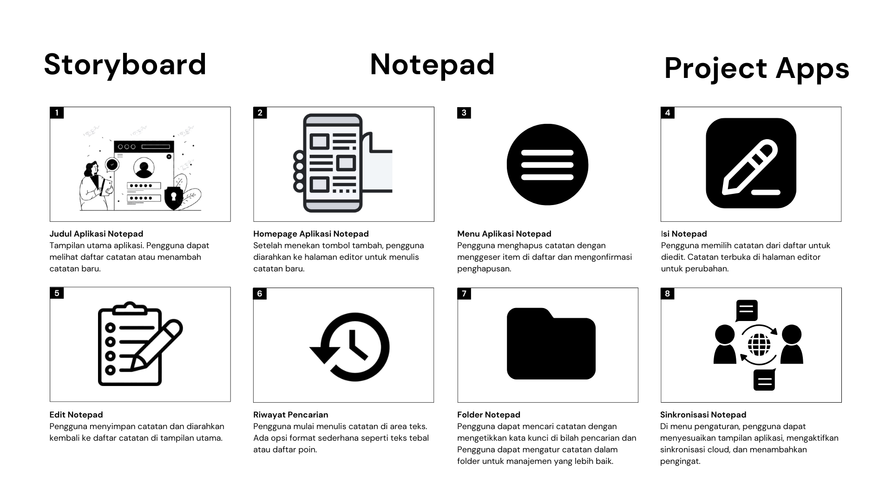
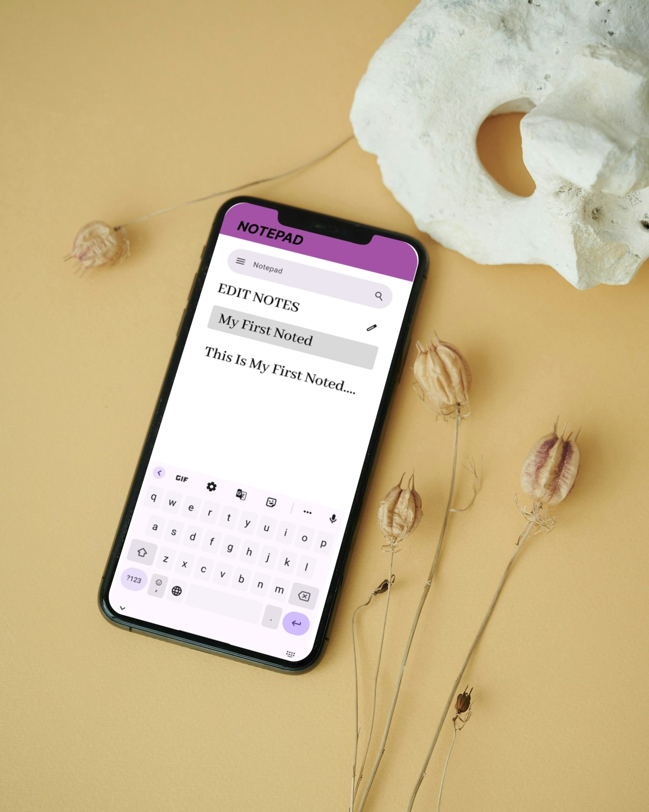
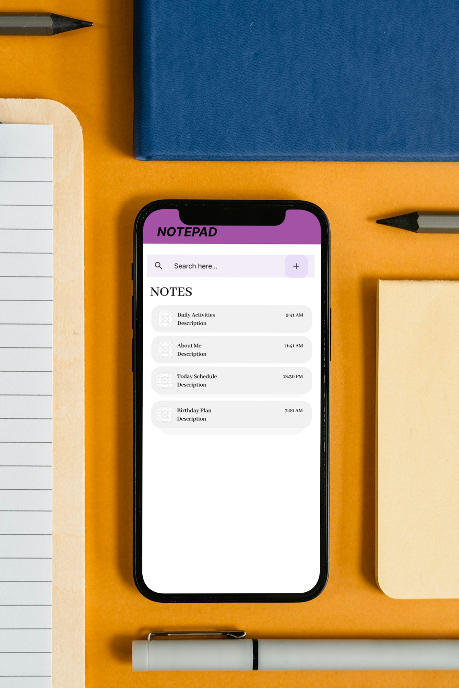
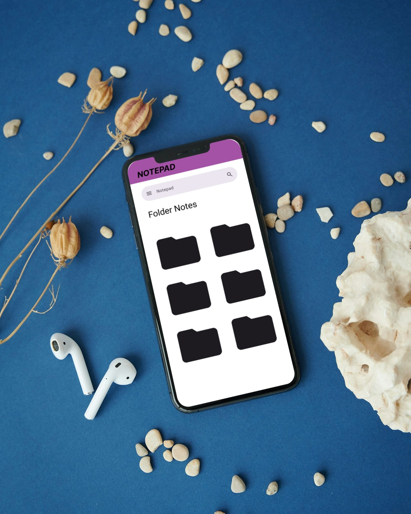
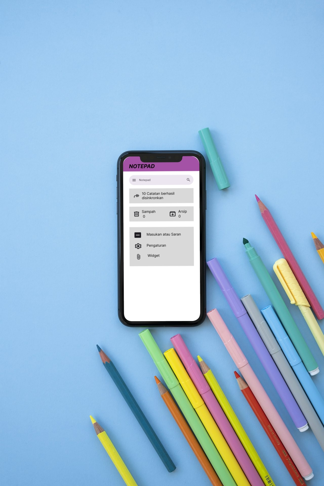

# Notepad-App
Notepad adalah aplikasi yang digunakan untuk menulis, mengedit, dan menyimpan teks dalam format teks biasa (plain text). File yang dibuat menggunakan Notepad disimpan dengan ekstensi .txt, yang dapat dibuka oleh berbagai aplikasi lain, baik di Windows, macOS, Linux, maupun perangkat seluler.
# Storyboard Notepad App

# Mockup Notepad App
# User Login

# Homepage UI

# Menu

# Content Notes

# Edit

# Search History

# Folders

# Sync

