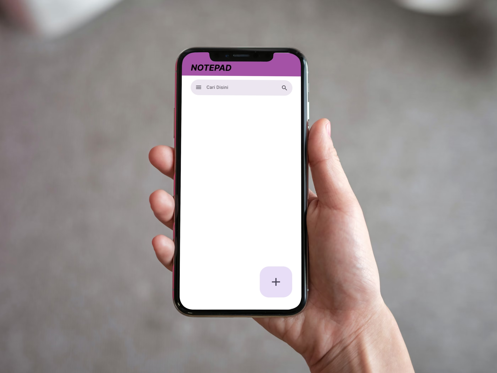
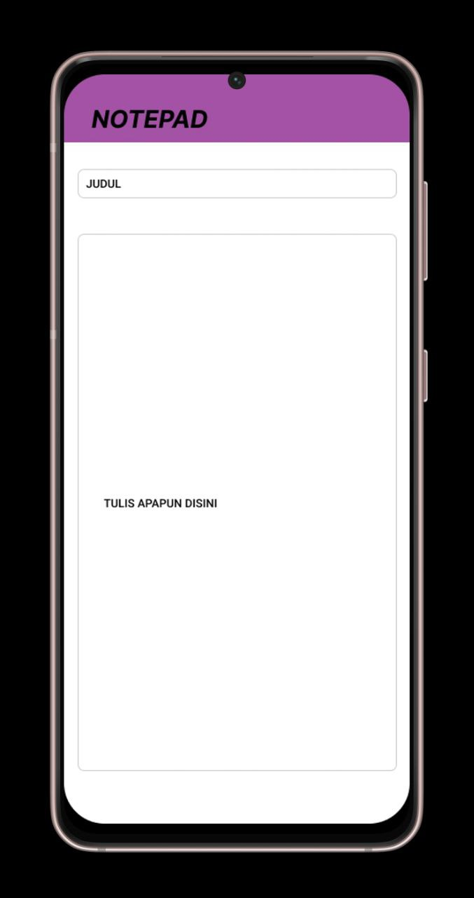

# Nama Pengembang
- Silvia Nirmalasari
# Belajar Di Universitas
- Universitas Pelita Bangsa
- Kelas : TI.23.C3 / Teknik Informatika
- NIM : 312310145

# Notepad-App

- Notepad adalah aplikasi yang digunakan untuk menulis, mengedit, dan menyimpan teks dalam format teks biasa (plain text) aplikasi plain text editor yang berfungsi untuk menulis teks tanpa fitur pemformatan seperti huruf tebal, miring, warna, atau gambar. Program ini hanya fokus pada konten teks saja, sehingga tidak cocok untuk dokumen yang membutuhkan tata letak atau format kompleks seperti yang dapat dilakukan di aplikasi pengolah kata seperti Microsoft Word. File yang dibuat menggunakan Notepad disimpan dengan ekstensi .txt, yang dapat dibuka oleh berbagai aplikasi lain, baik di Windows, macOS, Linux, maupun perangkat seluler.
# Fitur Utama Notepad
* Sederhana dan Ringan: Notepad adalah program yang sangat ringan dan tidak memakan banyak memori, sehingga cepat dibuka bahkan di Perangkat Android dengan spesifikasi rendah.
* Teks Murni (Plain Text): Tidak mendukung pemformatan seperti paragraf, tabel, atau gambar. Hanya teks polos yang bisa ditulis.
* Pencarian dan Penggantian: Memiliki fitur find (cari) dan replace (ganti) untuk mencari kata atau frasa tertentu di dalam teks.
* Kompatibilitas Tinggi: File .txt yang dihasilkan bisa dibuka oleh hampir semua program teks editor di berbagai sistem operasi, seperti Windows, macOS, atau Linux.
# Kode Program Yang Di-Pakai
- Kotlin
# Storyboard Notepad App

# Mockup Notepad App
# User Login In Notepad App

# Homepage UI

# Content Notes

